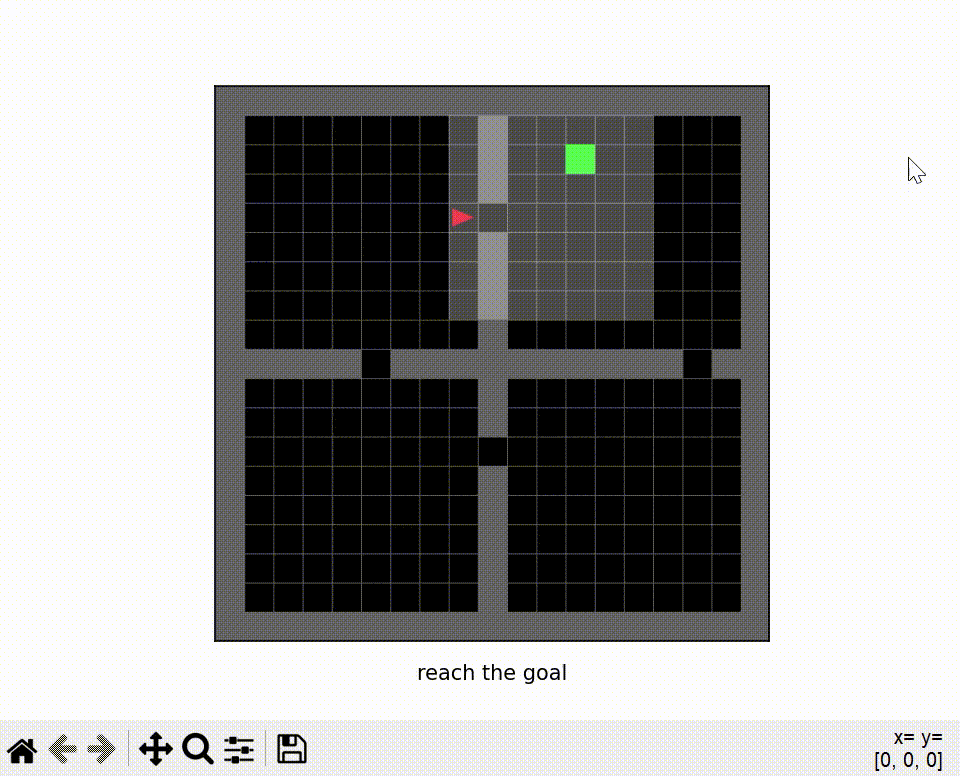
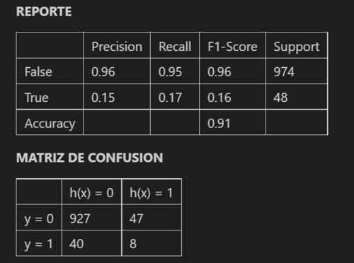
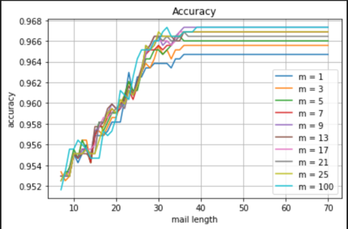
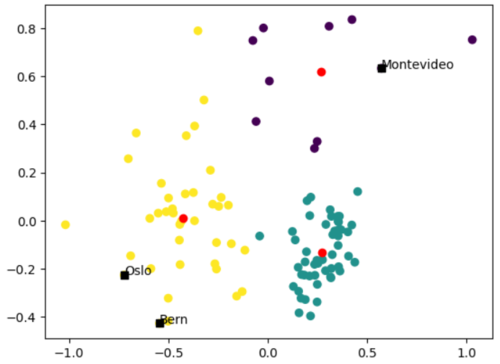

# Proyectos

### Aprendizaje por refuerzos:
- Entrenar mediante aprendizaje por refuerzos a un agente del juego mini-grid.

### Aprendizaje supervizado (Árboles de decisión):
- Implementación de un árbol de decisión para atributos continuos y aplicación a un problema real.

### Aprendizaje supervizado (Naive Bayes para texto):
- Implementación de naive bayes para identificación de correos de spam utilizando técnicas de stemming, tokenización y eliminación de stopwords.

### Aprendizaje no supervizado (K-means):
- Implementación del algoritmo k-means y evaluación mediante el método del codo, el coeficiente de silueta y PCA.

[**Proyectos de ML**] Los algoritmos implementados incluyen:

# Librerías

Son utilizadas las librerías más populares dentro de la ciencia de datos:

- [scikit-learn] - Librería de aprendizaje automático.
- [numpy] - Librería de álgebra lineal.
- [pandas] - Librería de manipulación de datos.
- [matplotlib] - Librería de visualización de datos.
- [nltk] - Librería de procesamiento de lenguaje natural.
- [gym] - Librería de aprendizaje por refuerzos.

